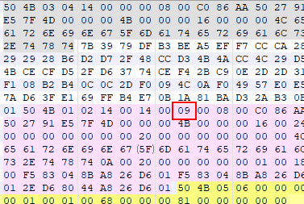
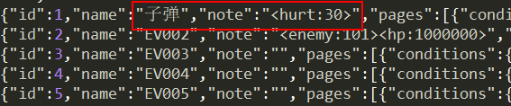
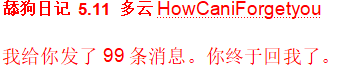
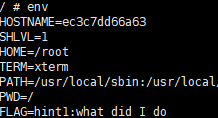
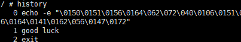
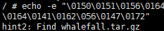
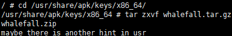
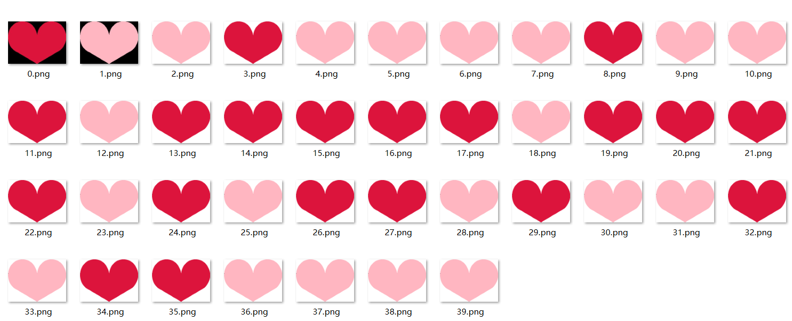
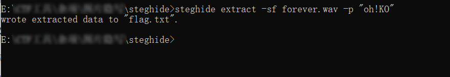
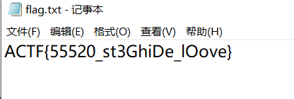

#### Let's dance

1. 命令 `binwalk -e Lets_dance.jpg` 获得一个压缩包

2. zip 伪加密修改 09 -> 00



3. 解压得到 **Learning_materials.txt**，下载**你也要起舞吗.avi**

4. 回到 Lets_dance.jpg，右键属性，备注中获得 outguess 密码 **You_can_really_dance**

5. 命令 `outguess -k "You_can_really_dance" -r Lets_dance.jpg out.txt`

6. 打开 out.txt 得到神秘代码 **8687125**

7. 使用 32 位 **VirtualDub** 及其插件 **MSUStegoVideo**，下载地址已在 hint 中给出，

   使用方法见 https://blog.csdn.net/wy_bk/article/details/85217583 **方法二**

8. 使用 out.txt 中得到的数字作为密码，照着上面的博客做，即可得到 flag


#### 饭友记

1. 有两类做法

   - Cheat Engine 修改金钱
   - 代码审计

2. 使用 CE 修改时需注意，在 MV 引擎中，金钱在内存中的值为实际显示的 2 倍

3. MV 引擎的缺点是程序逻辑在生成游戏包时不会被加密，放在 **www/js** 目录下，而且地图的事件以 json 格式被存储在 **www/data** 目录下，也没有加密，比如 Map001.json:

   

   可以直接修改子弹的伤害，也可以在 js 目录下找到有关金钱的处理程序并进行修改


#### 晚安

1. 命令 `binwalk -e wanan.png` 得到一个 zip

2. 解压又得到一张 wanan.png，命名为wanan2.png，使用 <a href="https://github.com/chishaxie/BlindWaterMark">github</a> 上的盲水印脚本，

   `python .\bwmforpy3.py decode .\wanan.png .\wanan2.png out.png` (windows 下)


3. 使用软件 Encrypto 打开 **舔狗日记.crypto**，密码就是 **ARJXU4MjE0**，保存得到一个文件夹

4. 打开文件夹将 **舔狗日记1.docx** 后缀改为 **.zip**，解压得到 **remember.zip**，由其中的提示得知 **舔狗日记2.docx** 的密码为 **8 位数字**

5. 使用 hashcat 爆破（会使用到 office2john.py），具体的使用方法请自行百度，得到密码 **19990821**

6. 打开 舔狗日记2.docx，输入密码，勾选显示 **隐藏文字** 的选项，全选文字后换成红色

   

7. 使用工具 **wbStego4.3open** 打开 **最终我不想舔了.bmp**，将 HowCaniForgetyou 作为密码解密，得到 flag


#### Whale

1. 把 docker镜像拉取过来（以下指令省去 sudo）

   `docker pull registry.cn-hangzhou.aliyuncs.com/in1t/whalefall:misc`

2. 查看镜像的 IMAGE ID，我的是 1e89e3b91125

   `docker images`

3. 开一个容器运行该镜像

   `docker run -it 1e89e3b91125`

4. 执行 `env` 指令查看环境变量，发现 hint1

   

5. 于是使用 history 指令查看命令的历史执行记录

   

6. 将 echo 指令复制下来并执行，得到 hint2



7. 使用 find 指令查找目标文件，找到路径 **/usr/share/apk/keys/x86_64/whalefall.tar.gz**

   `find / -name whalefall.tar.gz`

8. 移动到该目录，并解压，得到两个文件，whalefall.zip 有密码，由第二个文件名得知还有一个 hint

   

9. 使用 find 与 xargs 指令查找 /usr 目录下文件内容含有 hint3 的文件

   `find /usr | xargs grep hint3`

10. 得到文件名 **/usr/lib/engines-1.1/controls**，cat 查看，Ook 解码得到 whalefall.zip 的密码 **Dockerhub_1s_a_n1ce_place**

11. 将 whalefall.zip 拷贝到主机（ec3c7dd66a63 为容器 ID），并复制到 windows 中

    `docker cp ec3c7dd66a63:/usr/share/apk/keys/x86_64/whalefall.zip /usr`

12. 使用密码解压，010 打开拖到末尾，有一串摩斯电码，解码得到 flag


#### 神奇的时钟

每个格子的数值为一天内某一时刻的秒数，只画分针和秒针，拼成一张图即为 flag

```python
from turtle import *
 
def Skip(step):
	penup()
	forward(step)
	pendown()
 
def mkHand(name, length):
	reset()
	Skip(-length*0.1)
	begin_poly()
	penup()
	forward(length*1.1)
	pendown()
	end_poly()
	handForm = get_poly()
	register_shape(name, handForm)

def Init(i):
	global minHand, secHand
	hideturtle()
	mkHand("minHand" + str(i), 5)
	mkHand("secHand" + str(i), 10)
	minHand = Turtle()
	minHand.shape("minHand" + str(i))
	secHand = Turtle()
	secHand.shape("secHand" + str(i))
	for hand in [minHand, secHand]:
		hand.shapesize(1, 1, 1.2)
		hand.speed(10)

def Tick(xi, yi, sec):
	hideturtle()
	m, second = divmod(sec, 60)
	h, m = divmod(m, 60)
	minute = m + second/60.0
	minHand.penup()
	secHand.penup()
	minHand.goto(-1120 + xi * 20, 380 - yi * 20)
	secHand.goto(-1120 + xi * 20, 380 - yi * 20)
	minHand.down()
	secHand.down()
	secHand.setheading(6*second)
	minHand.setheading(6*minute)
 
def main(line):
	screensize(2280, 540, None)
	mode("logo")
	xi = 0
	yi = 0
	for i in range(len(data)):
		if i >= line and i % line == 0:
			xi = 0
			yi += 1
		tracer(False)
		Init(i)
		tracer(True)
		Tick(xi, yi, int(data[i]))
		xi += 1
	mainloop()

def readcsv():
	database = []
	with open("abort_hour.csv") as f:
		data = f.read().split('\n')
	for i in data:
		database += i.split(',')
	return database
 
if __name__ == '__main__':
	data = readcsv()
	main(112)
```


#### 密码守护者

随便用个啥语言(易语言yyds)编程，给按钮窗口发个双击消息就行了，会用到如 PostMessageA 这样的 API


#### 520 ####

520.gif只有两种颜色不停闪动，联想到01二进制，于是对GIF图片520.gif进行分帧，得到40张图片：



粉色代表0，红色代表1，将二进制转换成ASCII码可以得到一串字符："oh!KO"

脚本如下：

```python
pink = open('G:/CuteCode/Python/CTF脚本/2020校赛/img/0.png', 'rb').read()
red = open('G:/CuteCode/Python/CTF脚本/2020校赛/img/0.png', 'rb').read()

flag = ''

for i in range(40):
    color = open('G:/CuteCode/Python/CTF脚本/2020校赛/img/%d.png'%i, 'rb').read()
    if(color == pink):
        flag += '0'
    else:
        flag += '1'

ans = ''
length = len(flag)//8
for i in range(length):
    ans += chr(int(flag[i*8: (i+1)*8], 2))

print(ans)
```

接着解压520.zip，这里是伪加密，通过十六进制编辑器修改之后即可顺利解压。

得到一个wav音频，使用steghide进行提取，密码就是上面得到的oh!KO，可以提取出flag.txt



