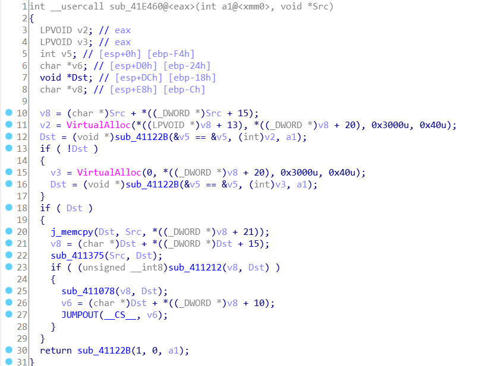
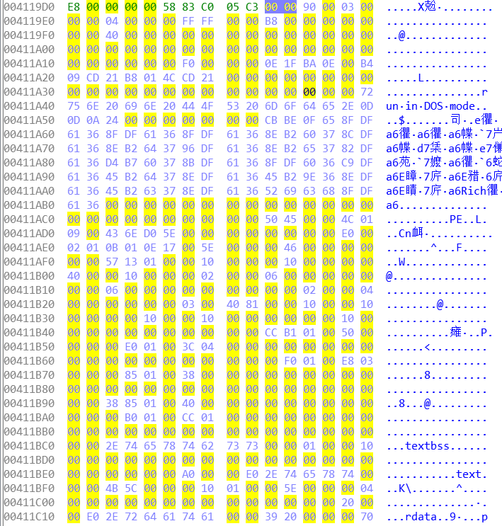

#### SOLUTION


1. 首先找 main 函数，找关键部分，看程序做了什么，可以通过动调，也可以通过hint查找

   

   调用此函数的部分也可以通过交叉引用得到，这样可以得到 Src 是 `0x4119DA`

2. 跟进 `sub_411078` ，结合 Src 地址，可以分析出这是一个节的加载过程。后面的一些函数也是做了一些重定位的工作。

3. `0x4119DA` 处，可以看出，是一个 PE 文件的格式

   

4. 之前主要函数中的 Dst 就是该 PE 文件的加载地址了，同时可以看到最后是 JUMP 到了程序入口点，根据节加载时候的地址关系计算其与基地址偏移，或者动调查看。当然 dump PE 文件这部分分析更方便。

5. `sub_412E3A` 的函数中做了输入输出，之后调用了某一函数，进入了一大堆花指令，花指令的解决通过IDA快捷键即可。主要使用了3种花指令

   ```c
   // call 之后改变栈顶返回地址 使用了模式展开
   #define FlowerCode0 \
   	__asm { \
   		_asm call $+0x0B \
   		_asm __emit 0xE8 \
   		_asm jmp $+0x13 \
   		_asm pop eax \
   		_asm add eax, 1 \
   		_asm push eax \
   		_asm mov eax, esp \
   		_asm xchg eax, [eax] \
   		_asm pop esp \
   		_asm mov [esp], eax \
   		_asm ret \
   	}
   
   // 重叠指令
   #define FlowerCode1 \
       __asm { \
   		_asm __emit 0xEB \
           _asm __emit 0xFF \
           _asm __emit 0xC0 \
           _asm __emit 0x48 \
           _asm __emit 0x90 \
           _asm __emit 0x90 \
       }
   
   // 简单的两个跳转分支
   #define FlowerCode2 \
       __asm { \
   		_asm jz	$ + 0x11 \
   		_asm jnz $ + 0xB \
   		_asm __emit 0xE9 \
   		_asm __emit 0x00 \
   		_asm __emit 0x10 \
   		_asm __emit 0x40 \
   		_asm __emit 0x00 \
   	}
   ```

6. 动调先进入了一个函数，执行的是用输入前 5 位异或解密某一函数，可通过常用函数开头的 5 个字节解得前 5 个字符。之后 IDAPython 或 IDC 脚本 patch 一下。

7. 再又经过一大堆花指令后就调用了刚才 patch 过的函数，之后就是寻常算法逆向了，使用前两位的十六进制值做了 3 次运算，分别对字符串中某些部分做了 * + ^ 运算，之后与一数组比较，通过前两位的十六进制数 % 0x11 == 0 且 % 0x3 == 0，可解得。
